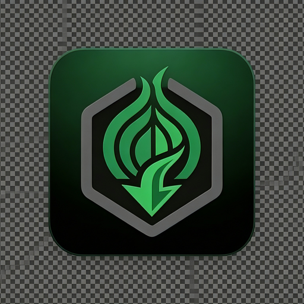

<p align="center">
  
</p>

<h1 align="center">TorBox Downloader</h1>

<p align="center">
<a href="LICENSE"></a>

</p>

Desktop app to search movies (Cinemeta), find torrents (Torrentio), and download them
through TorBox's debrid service. Built with **Electron + React + TypeScript + Tailwind**.

> Unofficial hobby project. Not affiliated with TorBox, Stremio/Cinemeta, or Torrentio.
> This is a general-purpose client — it doesn't host or index any content itself.
> Use it only for content you have the legal right to download in your jurisdiction.

All network, disk, and secret handling runs in the Electron **main process** (Node),
so there are no CORS issues and no API keys ever reach the renderer.

## Features

- Movie search (via Cinemeta) with debounced input — no metadata API key needed
- Instant-download (⚡) badge for torrents TorBox already has cached
- One-click add to TorBox with a season-pack-aware file picker, so the actual
  movie downloads instead of a sample or subtitle file
- Live progress, speed, and ETA for every download
- Download history that persists across app restarts
- Cancel, retry, reveal-in-Finder, and open-file actions on any download
- Desktop notification when a download finishes
- Configurable download folder and concurrent-download limit

## Download

Prebuilt binaries are attached to the [Releases](../../releases) page:

| Platform | File |
|----------|------|
| macOS (Apple Silicon + Intel) | `TorBox Downloader-*.dmg` |
| Linux | `TorBox Downloader-*.AppImage` |
| Windows | not yet published — see [Building](#building-distributables) |

macOS builds are unsigned (no Apple Developer account). After opening the DMG,
right-click the app → **Open** to bypass Gatekeeper's "unidentified developer"
warning (only needed the first time).

## Requirements (for development)

- Node.js 20+ (tested on 24)
- A **TorBox** account + API key (paid) — <https://torbox.app>

Movie search uses Stremio's free **Cinemeta** addon, so **no metadata API key is
needed** — the TorBox key is the only thing you provide.

## Setup

```bash
npm install
npm run dev        # launches the app with hot reload
```

On first launch, open **Settings** and paste your TorBox key. It's encrypted with
your OS keychain (Electron `safeStorage`) and stored locally.

## Scripts

| Command | What it does |
|---------|--------------|
| `npm run dev` | Run the app in development (HMR) |
| `npm run build` | Type-bundle main/preload/renderer into `out/` |
| `npm run typecheck` | Type-check main, preload, renderer, and tests |
| `npm test` | Run the `node:test` suite (parsing/selection/formatting logic) |
| `npm run generate-icons` | Regenerate `build/icon.*` from a source image |
| `npm run package` | Build local distributables via electron-builder (`dist/`) |

## How it works

1. **Search** → Cinemeta `catalog/movie/top/search=…json` (debounced 350 ms) —
   returns IMDb ids + posters directly, no API key.
2. **Streams** → Torrentio `/stream/movie/{imdb}.json` (cached 1 h locally).
3. **Cached badge** → batched TorBox `checkcached` marks instant torrents ⚡.
4. **Download** → magnet (with trackers) → `createtorrent` → poll `mylist`
   (3 s→10 s backoff) → pick the right file (`fileIdx` / largest video,
   validated against the actual file list so metadata/sample files are never
   mistaken for the movie) → fresh `requestdl` URL → streamed to disk with
   live progress/speed/ETA.
5. **Manage** → the queue persists across restarts; downloads can be canceled,
   retried, and revealed/opened, with a desktop notification on completion.

## Architecture

```
src/
├── main/          Node process — all APIs, downloads, secrets
│   ├── index.ts   window + lifecycle
│   ├── ipc.ts     IPC handlers + download pipeline
│   ├── store.ts   safeStorage-encrypted settings
│   ├── downloadsStore.ts  persisted queue/history
│   ├── cache.ts   TTL cache
│   └── services/  cinemeta · torrentio · torbox · downloads
├── preload/       contextBridge → typed window.api
├── shared/        types shared across processes
└── renderer/      React UI (Zustand, Tailwind)
test/              node:test suite for the services above
```

## Building distributables

```bash
npm run generate-icons   # only needed once, or after changing build/icon source
npm run package          # builds for the current host platform(s) configured
```

This produces a universal macOS `.dmg` and a Linux `.AppImage` in `dist/`.
Windows `.exe` (NSIS) needs to be built on Windows, or on macOS/Linux with Wine
installed (`brew install --cask wine-stable`) — cross-building NSIS installers
without Wine isn't supported by electron-builder.

## Contributing

Bug fixes, features, and cleanups are welcome — see [CONTRIBUTING.md](CONTRIBUTING.md)
for dev setup and what to run before opening a PR.

## License

[MIT](LICENSE) © John Lauron
